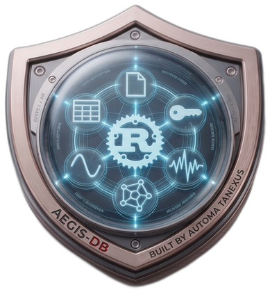
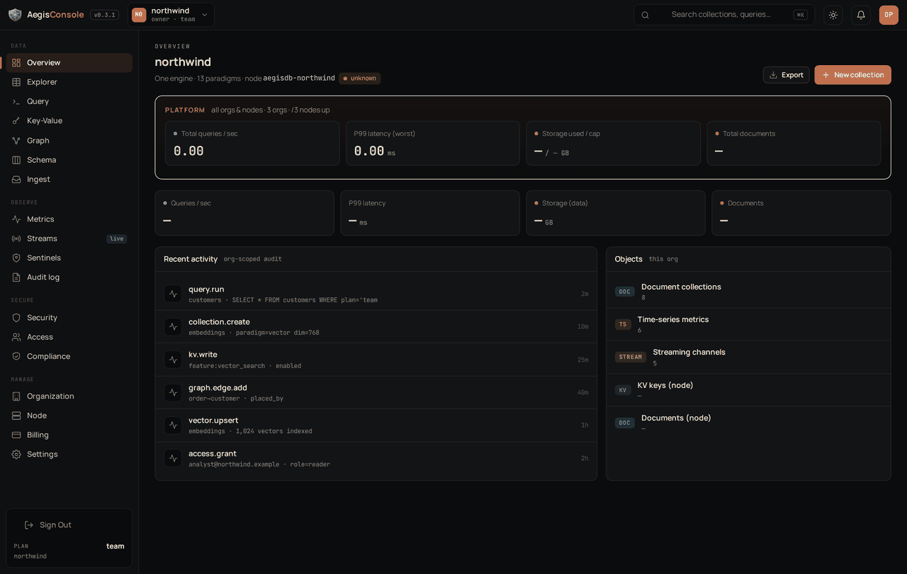
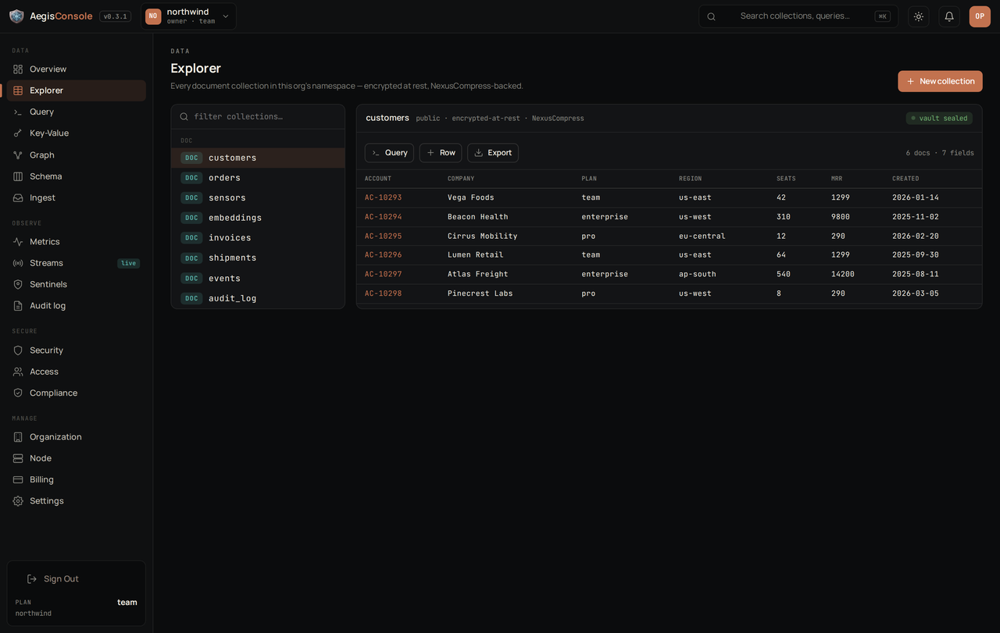
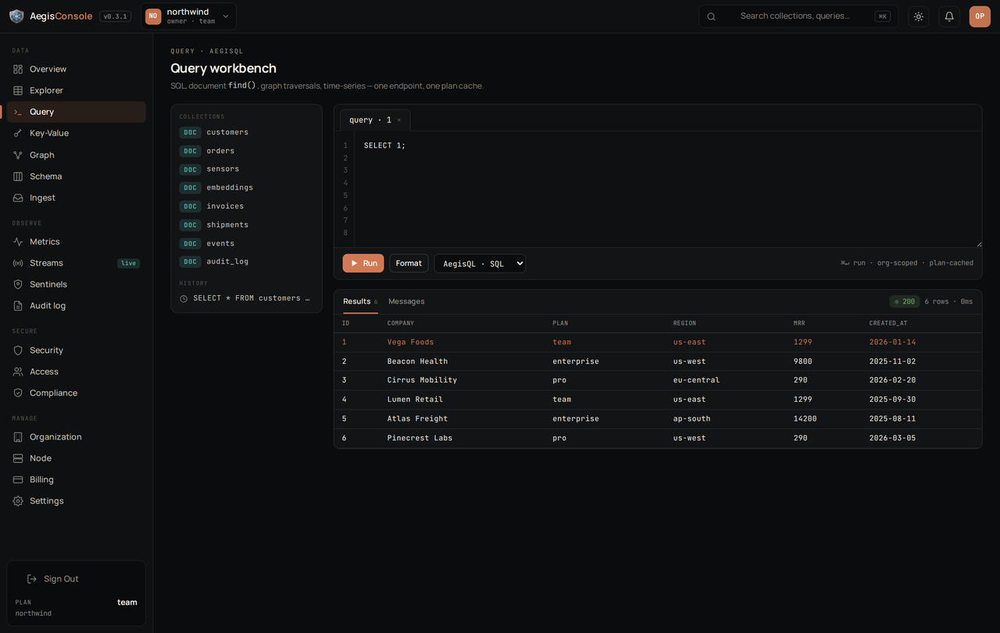
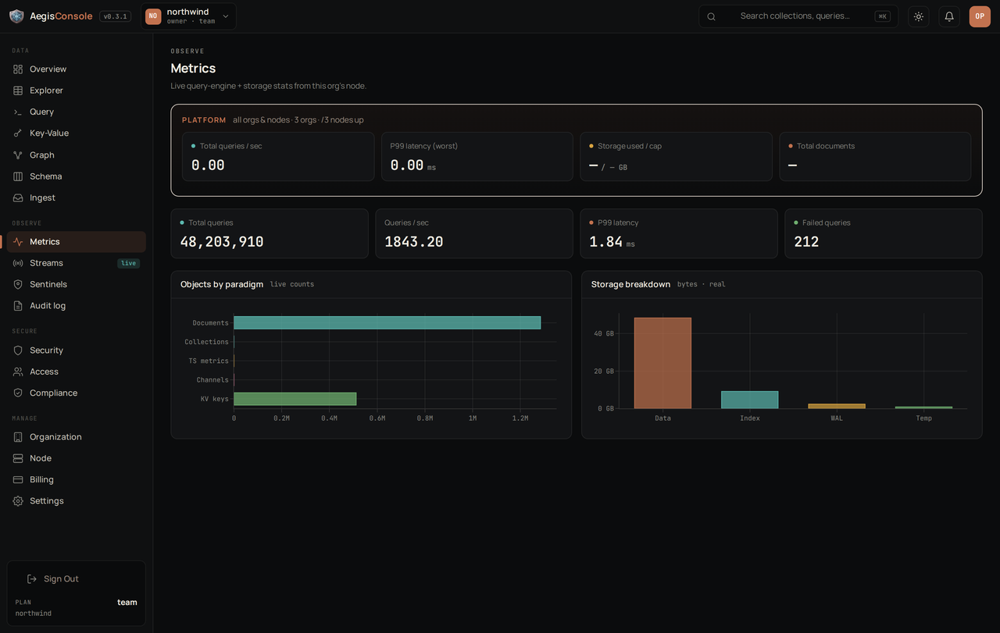
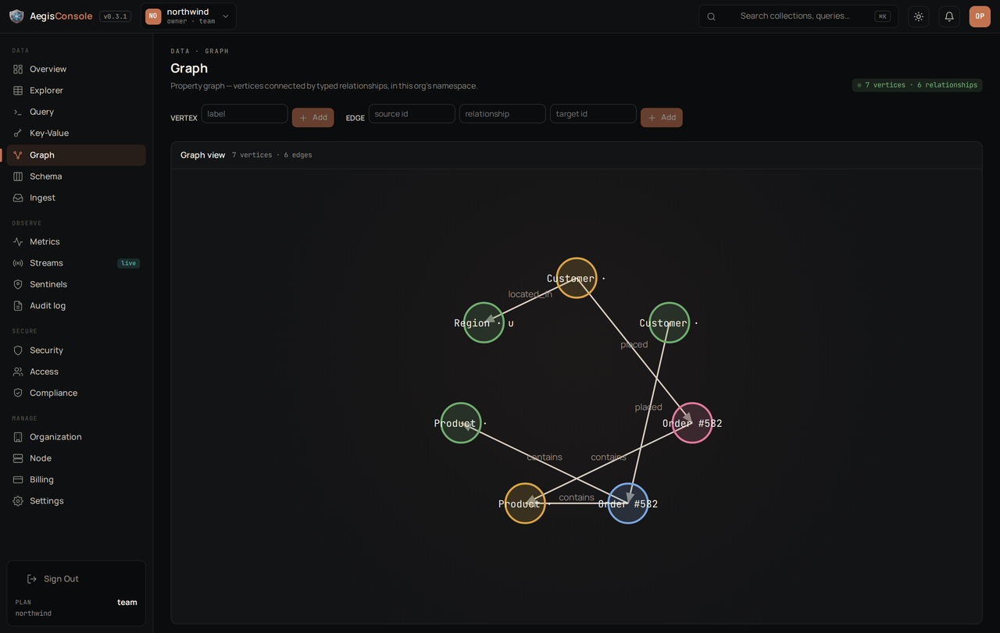
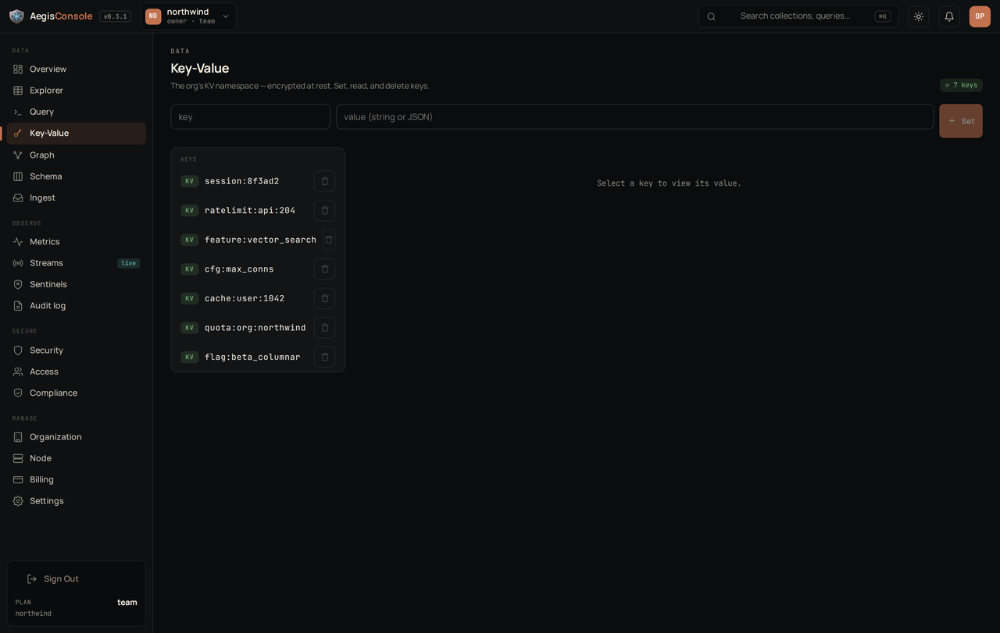

<div align="center">



# AegisConsole Desktop

**The full AegisConsole, running locally against your own AegisDB node.**

[](https://github.com/AutomataNexus/AegisConsole-Desktop-Releases/releases/latest)
[](https://github.com/AutomataNexus/AegisConsole-Desktop-Releases/releases)
[](docs/INSTALL.md)
[](https://tauri.app)
[](docs/INSTALL.md#verifying-your-download)
[](docs/DEPLOY.md)
[](LICENSE)

[**⬇ Download**](https://github.com/AutomataNexus/AegisConsole-Desktop-Releases/releases/latest) ·
[User Guide](docs/USER_GUIDE.md) ·
[Install](docs/INSTALL.md) ·
[Self-host](docs/DEPLOY.md) ·
[Changelog](CHANGELOG.md)

<br/>



</div>

This is the public **downloads, documentation, and legal** home for AegisConsole
Desktop. The application source is maintained privately; every installer published
here is built by CI and ships with **SLSA Provenance level 3** attestation so you
can verify exactly how it was produced.

> AegisConsole Desktop runs the complete AegisConsole experience **on your own
> machine, against an AegisDB node you operate**. Your data never leaves your
> infrastructure through this app. When you're ready to scale, one click upgrades
> you to the managed cloud.

## Download

Get the latest installer for your platform from the
[**Releases**](https://github.com/AutomataNexus/AegisConsole-Desktop-Releases/releases/latest)
page:

| Platform | File |
|---|---|
| Windows 10/11 (x64) | `AegisConsole_*_x64-setup.exe` |
| macOS 12+ (Apple Silicon) | `AegisConsole_*_aarch64.dmg` |
| Linux (Debian/Ubuntu) | `aegis-console-desktop_*_amd64.deb` |
| Linux (portable) | `aegis-console-desktop_*_amd64.AppImage` |

Each release also includes a `*.intoto.jsonl` provenance file — see
[Verifying your download](docs/INSTALL.md#verifying-your-download).

## What it does

- **Local-first** — talks directly to your AegisDB node; nothing is sent to us.
- **Account-less on-prem** — opens straight into the console, no login.
- **Every paradigm** — documents, key-value, query, graph, time-series, vector,
  full-text, geospatial, columnar, object store, wide-column, ledger.
- **One-click cloud upgrade** — move to managed hosting whenever you outgrow a
  single node.

## Screenshots

<table>
  <tr>
    <td width="33%"><a href="docs/img/preview-1.png"></a></td>
    <td width="33%"><a href="docs/img/preview-2.png"></a></td>
    <td width="33%"><a href="docs/img/preview-3.png"></a></td>
  </tr>
  <tr>
    <td><a href="docs/img/preview-4.png"></a></td>
    <td><a href="docs/img/preview-5.png"></a></td>
    <td><a href="docs/img/preview-6.png"></a></td>
  </tr>
</table>

## Requirements

- An **AegisDB node** you can reach (default `http://127.0.0.1:9090`).
- 64-bit Windows 10+, macOS 12+, or a glibc Linux with WebKitGTK.

## Self-host (Docker / Kubernetes)

Prefer a web console over a desktop app? Run the **same obfuscated UI** as a
container against your node — see [docs/DEPLOY.md](docs/DEPLOY.md):

```bash
docker run -d -p 8080:80 -e AEGIS_NODE_URL="http://your-node:9090" \
  ghcr.io/automatanexus/aegisconsole-desktop:latest
```

Kubernetes manifests live in [`deploy/k8s/`](deploy/k8s/aegisconsole.yaml).

## Security & vaulting

AegisConsole runs entirely in **your** environment — it bundles **no SIEM and no
secrets store**, and does not require NexusShield or NexusVault. Your node, network
security, and data stay on your side.

If you want **local secret vaulting** or a **managed security / SIEM layer**
(NexusVault / NexusShield) for your on-prem deployment, reach out:
**devops@automatanexus.com**.

## Documentation

- [Installation & verification](docs/INSTALL.md)
- [User Guide](docs/USER_GUIDE.md)
- [Self-hosting (Docker / Kubernetes)](docs/DEPLOY.md)
- [Changelog](CHANGELOG.md)

## Legal

- [End User License Agreement](EULA.md)
- [Terms of Service](TERMS.md)
- [Privacy Policy](PRIVACY.md)
- [License](LICENSE)

## Support

Open an [issue](https://github.com/AutomataNexus/AegisConsole-Desktop-Releases/issues)
or email **support@automatanexus.com**.

## Maintainer

**AutomataNexus LLC** — Andrew Jewell Sr. ([@AutomataControls](https://github.com/AutomataControls)) ·
[automatanexus.com](https://automatanexus.com)

---

Proprietary © 2026 AutomataNexus LLC. All rights reserved. Use is governed by the
[EULA](EULA.md).
